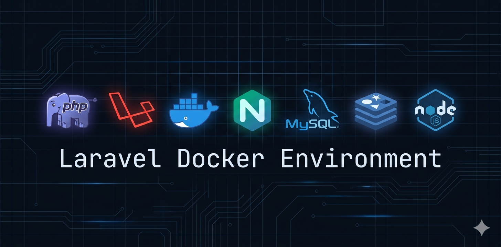

<p align="center">
  
</p>

# LaraDoc Starter

One Docker environment, multiple Laravel projects. No Laragon, no XAMPP, no paid tools. No duplicate containers.

## Stack

| Service | Version |
|---|---|
| PHP-FPM | 8.4 (Alpine) |
| Nginx | 1.27 (Alpine) |
| MySQL | 8.0 |
| Redis | 7 (Alpine) |
| phpMyAdmin | 5.2 |
| Mailpit | v1.21 |
| Node / Vite | 22 (optional) |

---

## How It Works

```
laradoc_starter/
├── docker/
│   ├── php/
│   │   ├── Dockerfile              ← PHP 8.4 image with all Laravel extensions
│   │   └── php.ini                 ← PHP settings (512M memory, OPcache, etc.)
│   ├── nginx/
│   │   ├── conf.d/                 ← One .conf per project (auto-loaded by Nginx)
│   │   │   └── default.conf        ← Catch-all welcome page
│   │   └── project.conf.template   ← Template used by add-project.bat
│   ├── mysql/
│   │   └── my.cnf                  ← MySQL config (utf8mb4, slow query log)
│   └── vite.config.js              ← Docker-ready Vite config stub
├── src/                            ← All your Laravel projects live here
│   ├── project-a/
│   ├── project-b/
│   └── project-c/
├── docker-compose.yml
├── .env.docker.example             ← Copy to .env.docker and fill in values
├── setup.bat                       ← Step 1: start the environment (Windows)
├── setup.sh                        ← Step 1: start the environment (Mac/Linux)
├── add-project.bat                 ← Step 2: add a project (Windows)
└── Makefile                        ← Shortcuts for common commands
```

**One set of containers serves all projects.** Each project gets its own Nginx server block on its own port, its own database, and its own `.env`.

---

## Quick Start

> **Only requirement: [Docker Desktop](https://www.docker.com/products/docker-desktop) installed and running.**

### Step 1 — Start the environment

```bat
# Windows
setup.bat

# Mac / Linux
bash setup.sh
```

This builds the PHP image and starts MySQL, Redis, Nginx, Mailpit, and phpMyAdmin. No project is created yet.

### Step 2 — Add your first project

```bat
# Windows
add-project.bat my-app 8080

# Mac / Linux
bash add-project.sh my-app 8080
```

Your app is now live at **http://localhost:8080**.

---

## Adding Projects — All Scenarios

### Scenario 1 — Fresh Laravel (new project from scratch)

```bat
add-project.bat my-app 8080
```

- Creates a brand new Laravel project in `src/my-app/`
- Sets up `.env`, database, permissions, app key, migrations
- Live at `http://localhost:8080`

---

### Scenario 2 — Clone from Git

```bat
add-project.bat my-app 8080 --clone https://github.com/you/my-app
```

- Clones the repo into `src/my-app/`
- Sets up `.env`, database, permissions, runs `composer install` + migrations
- Live at `http://localhost:8080`

---

### Scenario 3 — Copy existing local project

1. Copy your existing Laravel folder into `src/`:
```
src/my-app/   ← paste your project here
```

2. Then run:
```bat
add-project.bat my-app 8080 --existing
```

- Skips project creation (folder already there)
- Sets up `.env` if missing, creates database, fixes permissions
- Runs `composer install` + migrations
- Live at `http://localhost:8080`

---

### Adding more projects

Each project needs a unique name and port:

```bat
add-project.bat my-app  8080
add-project.bat blog    8082
add-project.bat api     8083
```

If you skip the port, it auto-detects the next free one starting from 8080.

---

## Services & Ports

| Service | URL |
|---|---|
| Project (default) | http://localhost:8080 |
| phpMyAdmin | http://localhost:9090 |
| Mailpit UI | http://localhost:8025 |
| Mailpit SMTP | localhost:1025 |
| MySQL | localhost:3306 |
| Redis | localhost:6379 |
| Vite HMR | http://localhost:5173 |

---

## Daily Commands

```bash
make up          # start all containers
make down        # stop all containers
make restart     # restart all containers
make ps          # show container status
make logs        # tail all logs
make shell       # bash into PHP container
make help        # see all available commands
```

---

## Per-Project Artisan & Composer

Since `src/` holds multiple projects, specify the project when running commands:

```bash
# Artisan
docker compose exec php sh -c "cd /var/www/html/my-app && php artisan migrate"
docker compose exec php sh -c "cd /var/www/html/my-app && php artisan make:controller UserController"

# Composer
docker compose exec php sh -c "cd /var/www/html/my-app && composer require laravel/sanctum"

# Or use make with PROJECT= variable
make migrate PROJECT=my-app
make tinker  PROJECT=my-app
```

---

## Frontend / Vite (optional)

```bash
make dev         # starts Vite HMR alongside all services
make vite-config # copies Docker-ready vite.config.js into src/
```

---

## Clean Slate

```bash
# Wipe everything and start fresh
setup.bat --fresh       # Windows
bash setup.sh --fresh   # Mac / Linux
```

This removes all containers, volumes (including databases), and starts over.

---

## Installing `make`

| OS | Command |
|---|---|
| **Windows** | `winget install GnuWin32.Make` |
| **macOS** | Already included |
| **Ubuntu / Debian** | `sudo apt install make` |
| **Fedora / RHEL** | `sudo dnf install make` |
| **Arch** | `sudo pacman -S make` |
