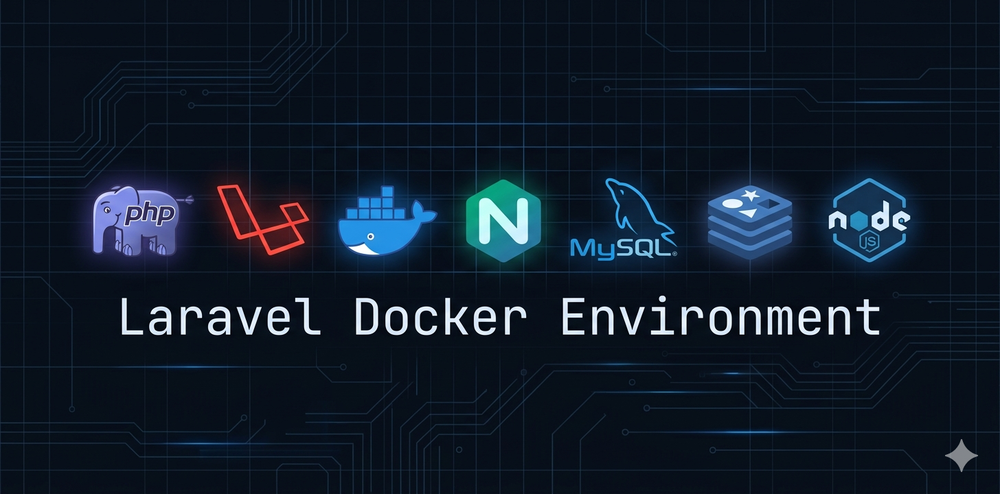

<p align="center">
  
</p>

# LaraDoc Starter

A lightweight, multi-tenant Docker local environment for Laravel. Access multiple isolated Laravel projects simultaneously on **port 80** using local subdomains, powered by a single shared container stack. 

No port conflicts, no heavy virtual machines, and no complex manual DNS routing.

---

## 🛠️ Stack

| Service | Version |
|---|---|
| **PHP-FPM** | 8.4 (Alpine) |
| **Nginx** | 1.27 (Alpine) |
| **MySQL** | 8.0 |
| **Redis** | 7 (Alpine) |
| **phpMyAdmin** | 5.2 |
| **Mailpit** | v1.21 |
| **Node / Vite** | 22 (optional) |

---

## 🚀 Quick Start (SOP)

> **Prerequisite:** [Docker Desktop](https://www.docker.com/products/docker-desktop) must be installed and running.

### Step 1 — Initialize the Environment
Build the base PHP image and start the shared service containers (Nginx, PHP, MySQL, Redis, phpMyAdmin, Mailpit):

```bash
# Windows
setup.bat

# Mac / Linux
bash setup.sh
```
*Once started, visit **http://localhost** to view your developer dashboard showing your projects and services.*

---

### Step 2 — Onboard a Project
All your projects live inside the [`src/`](file:///c:/Users/User/Downloads/laradock_starter-main/src) folder. Choose one of the scenarios below to add your application:

#### Scenario A: Create a fresh Laravel project
```bash
# Windows
add-project.bat my-app

# Mac / Linux
bash add-project.sh my-app
```
*App will be live at: **http://my-app.localhost***

#### Scenario B: Import a Git repository
```bash
# Windows
add-project.bat my-app --clone https://github.com/org/repo.git

# Mac / Linux
bash add-project.sh my-app --clone https://github.com/org/repo.git
```
*App will be live at: **http://my-app.localhost***

#### Scenario C: Migrate an existing local folder
1. Copy your Laravel folder into the [`src/`](file:///c:/Users/User/Downloads/laradock_starter-main/src) folder (e.g. `src/my-app/`).
2. Run the onboarding script with the `--existing` flag:
   ```bash
   # Windows
   add-project.bat my-app --existing

   # Mac / Linux
   bash add-project.sh my-app --existing
   ```
*App will be live at: **http://my-app.localhost***

---

## 🌐 Local Domains & Services

All projects and developer utilities run on **port 80** and are automatically mapped to host subdomains. Browsers resolve `.localhost` subdomains to `127.0.0.1` locally, requiring no configuration.

| Service | Local URL | Description |
|---|---|---|
| **LaraDoc Dashboard** | [http://localhost](http://localhost) | Homepage scanning and listing all projects in `src/` |
| **Your Projects** | `http://[folder-name].localhost` | Dynamic routing to each project's public directory |
| **phpMyAdmin** | [http://phpmyadmin.localhost](http://phpmyadmin.localhost) | MySQL Database Web GUI |
| **Mailpit Inbox** | [http://mailpit.localhost](http://mailpit.localhost) | Local mail catcher UI (WebSocket real-time updates) |
| **Mailpit SMTP** | `localhost:1025` | SMTP port for local mail routing |
| **MySQL Database** | `localhost:3306` | Port to connect local GUI tools (TablePlus, HeidiSQL) |
| **Redis Cache** | `localhost:6379` | Port to connect local Redis UI clients |
| **Vite HMR** | `http://[folder-name].localhost:[5173-5183]` | Hot Module Replacement local ports |

---

## ⚙️ Daily Commands

All daily CLI helper commands are packaged into shortcuts inside the [`Makefile`](file:///c:/Users/User/Downloads/laradock_starter-main/Makefile).

### Manage Containers
```bash
make up          # Start environment services
make down        # Stop environment services (preserves databases)
make restart     # Restart environment services
make logs        # Tail container logs
make shell       # Shell into PHP container (scopes to PROJECT folder if specified)
```

### Run Project Tasks (Composer & Artisan)
Since multiple projects reside inside the `src/` folder, use the `PROJECT` variable to target commands. 

*Note: If you have **only one** project in the `src/` directory, the Makefile automatically detects and runs commands on it without requiring the `PROJECT` parameter.*

```bash
# Database Migrations
make migrate PROJECT=my-app
make migrate-fresh PROJECT=my-app

# Artisan Commands
make tinker PROJECT=my-app
make seed PROJECT=my-app

# Composer
make composer-install PROJECT=my-app
```

---

## 🔒 DX & Sandboxed Isolation Features

LaraDoc Starter uses a "WET" isolation approach to ensure that individual projects do not leak configuration or data into one another:

1. **MySQL Sandbox Isolation:** When adding a project, the script automatically creates a unique database user and secure password, granting it access *only* to that project's schema. Root MySQL privileges are kept secure.
2. **Redis Namespace Partitioning:** Each application gets a unique Redis database index (`REDIS_DB`) and custom prefixes (`REDIS_PREFIX` / `CACHE_PREFIX`) appended to its `.env`. This prevents session hijacks, cache collisions, and queue worker cross-consumption.
3. **Vite HMR Port Isolation:** A dedicated Vite HMR port (incremented from `5173`) is configured per project in the project's [`vite.config.js`](file:///c:/Users/User/Downloads/laradock_starter-main/docker/vite.config.js) to support concurrent frontend builds.
