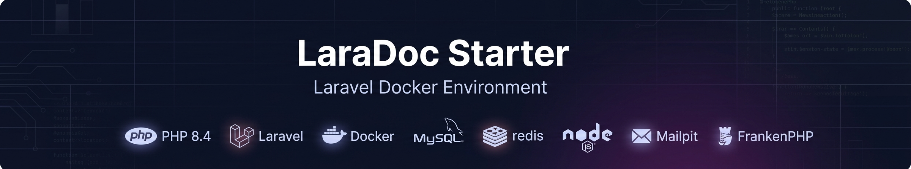

<p align="center">
  
</p>

# LaraDoc Starter

A lightweight, multi-project Docker local development environment for Laravel. Run multiple fully isolated Laravel projects simultaneously on **port 80** using local subdomains — powered by a single shared container stack.

No port conflicts, no heavy virtual machines, no complex DNS routing, no Nginx, no PHP-FPM.

---

## 🛠️ Stack

| Service | Version | Description |
|---|---|---|
| **FrankenPHP** | 1 / PHP 8.4 (Alpine) | Caddy + PHP in a single high-performance binary |
| **MySQL** | 8.0 | Dedicated database per project |
| **phpMyAdmin** | 5.2 | Web GUI for database management |
| **Redis** | 7 (Alpine) — optional | High-performance in-memory cache / queue |
| **Mailpit** | v1.21 — optional | Local email capture and testing |
| **Node / Vite** | 22 (Alpine) — optional | Dedicated frontend container for asset bundling |

> FrankenPHP embeds Caddy and PHP into a single binary. It replaces both Nginx and PHP-FPM — zero FastCGI overhead, one container instead of two.

---

## 🚀 Quick Start

> **Prerequisite:** [Docker Desktop](https://www.docker.com/products/docker-desktop) must be installed and running.

### Step 1 — Start the environment

```bash
# Windows
setup.bat

# macOS / Linux
bash setup.sh
```

This downloads the prebuilt FrankenPHP image (takes ~15–20s) and starts MySQL + phpMyAdmin. It also automatically registers the `laradoc` CLI into your user PATH.

Once started, open **http://localhost** to view your developer dashboard.

---

### Step 2 — Add a project

All projects live inside the `src/` folder. Pick your scenario:

#### Scenario A — Fresh Laravel project
```bash
# Windows
add-project.bat my-app

# macOS / Linux
bash add-project.sh my-app
```

#### Scenario B — Clone from Git
```bash
# Windows
add-project.bat my-app --clone https://github.com/you/repo.git

# macOS / Linux
bash add-project.sh my-app --clone https://github.com/you/repo.git
```

#### Scenario C — Existing project folder already in `src/`
```bash
# Windows
add-project.bat my-app --existing

# macOS / Linux
bash add-project.sh my-app --existing
```

**What the script does automatically:**
- Configures Caddy subdomain routing (`http://my-app.localhost`)
- Creates a dedicated MySQL database + user with secure credentials
- Generates `src/my-app/.env` preconfigured with Docker networking
- Installs Composer dependencies and generates `APP_KEY`
- Runs database migrations
- Places a local `laradoc` CLI shortcut inside `src/my-app/`
- Reloads FrankenPHP with zero downtime

Your app is instantly live at **http://my-app.localhost**.

---

## 🖥️ LaraDoc CLI

Use the built-in `laradoc` CLI from anywhere — no need to type long Docker commands:

```bash
# Run from repository root or inside any src/<project>/ folder:
laradoc artisan migrate
laradoc composer require spatie/laravel-permission
laradoc tinker
laradoc shell
```

### Smart Project Detection

`laradoc` automatically knows which project you want:

| Where you run it | Behavior |
|---|---|
| **Inside** `src/my-app/` | Auto-detects `my-app` — run commands directly |
| **Root** with 1 project | Auto-selects that project |
| **Root** with multiple projects | Specify project (`laradoc artisan blog migrate`) or pick from an interactive menu |

### Command Reference

| Command | Shortcut | Description |
|---|---|---|
| `laradoc artisan [args]` | `a` | Run any Artisan command |
| `laradoc composer [args]` | `c` | Run Composer inside project |
| `laradoc php [args]` | | Run raw PHP inside project |
| `laradoc tinker` | `ti` | Start Laravel Tinker REPL |
| `laradoc test [args]` | `t` | Run `php artisan test` |
| `laradoc shell [project]` | `sh` | Open bash terminal inside project container |
| `laradoc mysql [project]` | `db` | Open MySQL CLI connected directly to project DB |
| `laradoc npm [args]` | | Run npm commands |
| `laradoc add <name> [flags]` | | Add a new project |
| `laradoc up` | | Start containers |
| `laradoc down` | | Stop containers |
| `laradoc logs [service]` | | Stream container logs |
| `laradoc ps` | | Show container status |
| `laradoc build` | | Rebuild FrankenPHP image locally |
| `laradoc reload` | | Hot-reload FrankenPHP configuration |

---

## 🌐 Local Domains & Services

All projects and tools run on **port 80** using local `.localhost` subdomains. Browsers resolve `*.localhost` to `127.0.0.1` natively without any hosts file edits.

| Service | URL | Notes |
|---|---|---|
| **Developer Dashboard** | http://localhost | Project list, status & quick links |
| **Your Projects** | `http://[folder-name].localhost` | Zero-configuration routing |
| **phpMyAdmin** | http://phpmyadmin.localhost | User: `root`, Password: `rootsecret` |
| **Mailpit Web UI** | http://mailpit.localhost | Optional (`docker compose --profile extras up -d`) |
| **Mailpit SMTP** | `localhost:1025` | Port for local email sending |
| **MySQL** | `localhost:3306` | External port for GUI tools (TablePlus, DBeaver) |
| **Redis** | `localhost:6379` | Optional cache/queue backend |
| **Vite HMR** | `http://[folder-name].localhost:[5173+]` | Auto-assigned isolated HMR ports |

---

## ⌨️ VS Code Integration

Pre-configured tasks are included in `.vscode/tasks.json`. Press `Cmd+Shift+P` (Mac) or `Ctrl+Shift+P` (Windows) → **Tasks: Run Task**:

- **LaraDoc: Start Environment (`laradoc up`)**
- **LaraDoc: Stop Environment (`laradoc down`)**
- **LaraDoc: Run Artisan Command**
- **LaraDoc: Open Project Shell**
- **LaraDoc: View Container Status (`laradoc ps`)**
- **LaraDoc: Reload FrankenPHP**

---

## 🔒 Isolation Features

Each project runs in complete isolation:

1. **Database Isolation** — Unique database and non-root MySQL user per project.
2. **Cache & Session Isolation** — Projects default to Laravel's standard `database` driver. When using Redis, unique `REDIS_DB` index and prefixes prevent data bleeding.
3. **Vite Port Isolation** — Each project receives its own dedicated HMR port (incremented from 5173).
4. **Filesystem Isolation** — Projects are separated in `src/<project-name>` directories.

---

## 🔧 Optional Services

Redis and Mailpit are disabled by default to keep the footprint lean:

```bash
# Start Redis
docker compose up -d redis

# Start Mailpit
docker compose up -d mailpit

# Start all extra services
docker compose --profile extras up -d
```

---

## 🐘 Switching PHP Version

The stack supports **PHP 8.2** and **PHP 8.4** (default: 8.4).

1. In `.env.docker` (or create from `.env.docker.example`):
   ```env
   PHP_VERSION=8.2   # or 8.4
   ```

2. Restart containers:
   ```bash
   ./laradoc build
   ./laradoc up
   ```

---

## 🗂️ Project Structure

```
laradock-starter/
├── .vscode/
│   └── tasks.json                      # VS Code task shortcuts
├── docker/
│   ├── frankenphp/
│   │   ├── Dockerfile                  # Multi-arch FrankenPHP image
│   │   ├── php.ini                     # Custom PHP configuration
│   │   ├── Caddyfile                   # Main Caddy server config
│   │   ├── conf.d/                     # Auto-generated project site configs
│   │   │   └── default.caddyfile       # Dashboard + service routing
│   │   └── dashboard/
│   │       └── index.php               # Local development dashboard
│   └── mysql/
│       └── my.cnf                      # MySQL configuration
├── src/                                # All Laravel projects live here
├── laradoc                             # CLI wrapper (macOS / Linux)
├── laradoc.bat                         # CLI wrapper (Windows CMD)
├── laradoc.ps1                         # CLI wrapper (Windows PowerShell)
├── docker-compose.yml                  # Main service stack definition
├── setup.bat / setup.sh                # Automated setup scripts
├── add-project.bat / add-project.sh    # Automated project onboarding
└── .env.docker.example                 # Default environment template
```

---

## ♻️ Fresh Reset

Wipe all containers, volumes, and databases to start completely clean:

```bash
# Windows
setup.bat --fresh

# macOS / Linux
bash setup.sh --fresh
```
